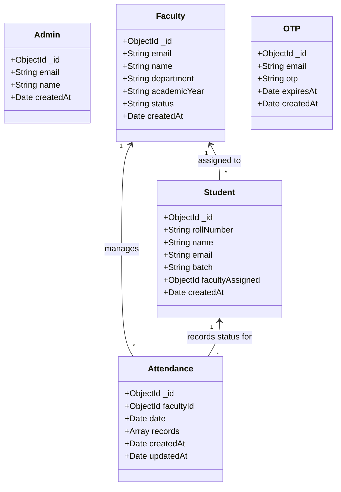
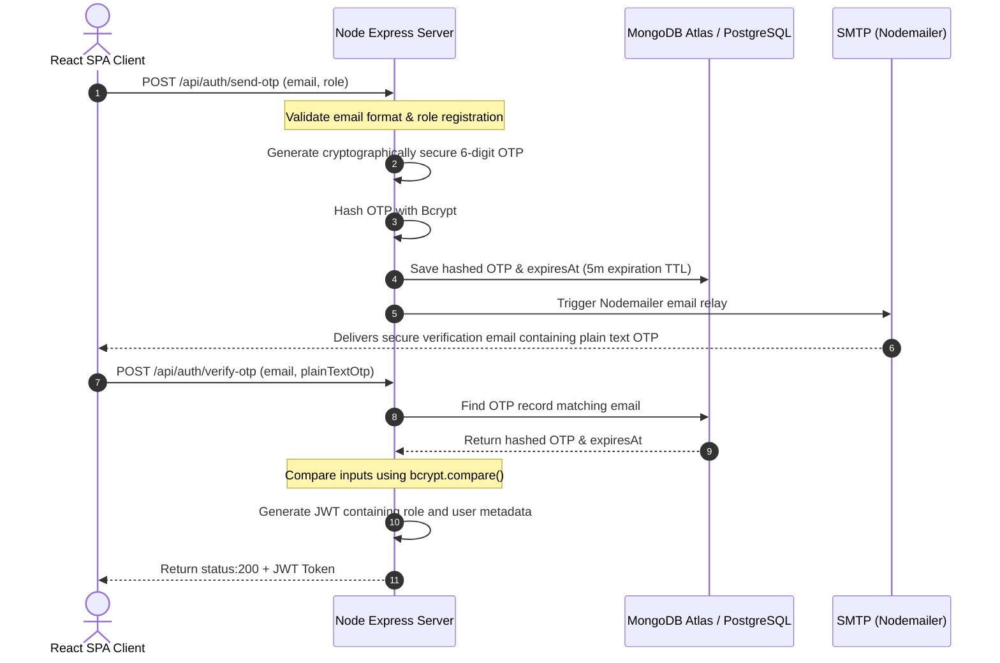
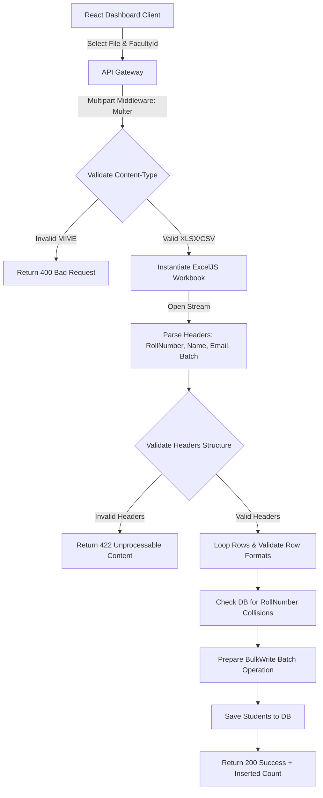

# Technical Design Document (TDD)
## UniSmart: AI-Powered University Learning Management System (ULMS)

| Metadata | Value |
| :--- | :--- |
| **Project Name** | UniSmart (ULMS) |
| **Document Version** | 1.0.0 |
| **Status** | Approved / Architecture Roster |
| **Tech Stack** | React, Tailwind CSS, Express, Node.js, MongoDB / PostgreSQL |
| **Last Updated** | July 12, 2026 |

---

## 1. System Architecture

The system utilizes a decoupled **Client-Server Architecture** designed for speed, flexibility, and independent scaling.

```
+----------------------------------------+
|             React Client               |
|      (Vite, Tailwind, Context API)     |
+----------------------------------------+
                   |
                   | REST API Requests (JSON / Multi-part form)
                   | Secured with Authorization: Bearer <JWT>
                   v
+----------------------------------------+
|           Express API Gateway          |
|      (JWT Verification, Rate Limits)   |
+----------------------------------------+
      |                  |             |
      | SMTP (TLS)       | SDK / API   | Database Queries
      v                  v             v
+-----------+     +------------+  +--------------------------------+
|Nodemailer |     |Firebase /  |  | MongoDB (Mongoose)             |
|SMTP Server|     |Cloudinary  |  |           - OR -               |
+-----------+     +------------+  | PostgreSQL (Prisma / SQL)      |
                                  +--------------------------------+
```

### Folder Structure Configuration
```text
unismart-website/
├── client/                     # Frontend SPA (Vite + React)
│   ├── public/                 # Static assets (audio chimes, logos)
│   └── src/
│       ├── assets/             # Images, fonts, styles
│       ├── components/         # Reusable UI (Calendar, SAI Panel, Modals, Loader)
│       ├── context/            # AuthContext, AttendanceContext
│       ├── hooks/              # useCustomAudio, useAxiosPrivate
│       ├── pages/              # Landing, AdminLogin, FacultyLogin, Dashboards
│       ├── utils/              # API Client (Axios), Sound triggers (Howler.js)
│       ├── App.jsx
│       └── main.jsx
├── server/                     # Backend API (Node.js + Express)
│   ├── config/                 # db.js, passport.js, mailer.js
│   ├── controllers/            # authController.js, adminController.js, facultyController.js
│   ├── middleware/             # authGuard.js, errorHandler.js, upload.js (Multer)
│   ├── models/                 # MongoDB schemas or Prisma models
│   ├── routes/                 # authRoutes.js, adminRoutes.js, facultyRoutes.js
│   ├── services/               # excelService.js, aiPredictionService.js
│   ├── utils/                  # helpers, validators
│   ├── server.js
│   └── package.json
└── docs/                       # Project documentation (PRD, TDD)
```

---

## 2. Database Design & Schema Specifications

To support flexibility across different database choices, detailed specifications are provided below for both **NoSQL (MongoDB/Mongoose)** and **Relational (PostgreSQL/SQL)**.

### 2.1 Option A: MongoDB & Mongoose Schemas (Selected Default)



#### Mongoose Code Definitions:

```javascript
// Faculty Schema
const FacultySchema = new mongoose.Schema({
  email: { type: String, unique: true, required: true },
  name: { type: String, required: true },
  department: { type: String, required: true },
  academicYear: { type: String, required: true }, // e.g., "2023-2024"
  status: { type: String, enum: ['Active', 'Inactive'], default: 'Active' },
  createdAt: { type: Date, default: Date.now }
});

// Student Schema
const StudentSchema = new mongoose.Schema({
  rollNumber: { type: String, unique: true, required: true },
  name: { type: String, required: true },
  email: { type: String, required: true },
  batch: { type: String, required: true },
  facultyAssigned: { type: mongoose.Schema.Types.ObjectId, ref: 'Faculty', required: true },
  createdAt: { type: Date, default: Date.now }
});

// Attendance Record Schema
const AttendanceSchema = new mongoose.Schema({
  facultyId: { type: mongoose.Schema.Types.ObjectId, ref: 'Faculty', required: true },
  date: { type: String, required: true }, // YYYY-MM-DD format to prevent timezone shifts
  records: [{
    studentId: { type: mongoose.Schema.Types.ObjectId, ref: 'Student', required: true },
    status: { type: String, enum: ['P', 'A'], required: true }
  }],
  createdAt: { type: Date, default: Date.now },
  updatedAt: { type: Date, default: Date.now }
});

// OTP Schema (TTL Indexed)
const OTPSchema = new mongoose.Schema({
  email: { type: String, required: true },
  otp: { type: String, required: true }, // Encrypted with Bcrypt
  createdAt: { type: Date, default: Date.now, expires: 300 } // Auto-deletes after 5 mins (300 seconds)
});
```

---

### 2.2 Option B: PostgreSQL & Relational SQL Schema (Prisma representation)

```prisma
datasource db {
  provider = "postgresql"
  url      = env("DATABASE_URL")
}

model Admin {
  id        String   @id @default(uuid())
  email     String   @unique
  name      String
  createdAt DateTime @default(now())
}

model Faculty {
  id           String       @id @default(uuid())
  email        String       @unique
  name         String
  department   String
  academicYear String
  status       String       @default("Active")
  students     Student[]
  attendance   Attendance[]
  createdAt    DateTime     @default(now())
}

model Student {
  id                String             @id @default(uuid())
  rollNumber        String             @unique
  name              String
  email             String
  batch             String
  facultyAssignedId String
  facultyAssigned   Faculty            @relation(fields: [facultyAssignedId], references: [id], onDelete: Cascade)
  attendanceRecords AttendanceRecord[]
  createdAt         DateTime           @default(now())
}

model Attendance {
  id         String             @id @default(uuid())
  facultyId  String
  faculty    Faculty            @relation(fields: [facultyId], references: [id], onDelete: Cascade)
  date       String // ISO Date format (YYYY-MM-DD)
  records    AttendanceRecord[]
  createdAt  DateTime           @default(now())
  updatedAt  DateTime           @updatedAt

  @@unique([facultyId, date])
}

model AttendanceRecord {
  id           String     @id @default(uuid())
  attendanceId String
  attendance   Attendance @relation(fields: [attendanceId], references: [id], onDelete: Cascade)
  studentId    String
  student      Student    @relation(fields: [studentId], references: [id], onDelete: Cascade)
  status       String // "P" or "A"

  @@unique([attendanceId, studentId])
}

model OtpRecord {
  id        String   @id @default(uuid())
  email     String
  otp       String // Hashed OTP
  expiresAt DateTime
  createdAt DateTime @default(now())
}
```

---

## 3. Core API Contract & Endpoints

### 3.1 Authentication Services

#### 3.1.1 Request One-Time Password (OTP)
* **Endpoint:** `POST /api/auth/send-otp`
* **Access:** Public
* **Payload:**
```json
{
  "email": "sarah.jenkins@unismart.edu",
  "role": "faculty"
}
```
* **Success Response (200 OK):**
```json
{
  "success": true,
  "message": "OTP sent to registered email address."
}
```

#### 3.1.2 Verify One-Time Password (OTP)
* **Endpoint:** `POST /api/auth/verify-otp`
* **Access:** Public
* **Payload:**
```json
{
  "email": "sarah.jenkins@unismart.edu",
  "otp": "857201"
}
```
* **Success Response (200 OK):**
```json
{
  "success": true,
  "token": "eyJhbGciOiJIUzI1NiIsInR5cCI6IkpXVCJ9...",
  "user": {
    "id": "603d2e29f8f23a1a68fb2d01",
    "email": "sarah.jenkins@unismart.edu",
    "role": "faculty",
    "name": "Sarah Jenkins"
  }
}
```

---

### 3.2 Super Admin Modules

#### 3.2.1 Create Faculty Account
* **Endpoint:** `POST /api/admin/faculty`
* **Access:** Authenticated (Admin JWT)
* **Payload:**
```json
{
  "name": "John Doe",
  "email": "john.doe@unismart.edu",
  "department": "Computer Science",
  "academicYear": "2025-2026"
}
```
* **Success Response (201 Created):**
```json
{
  "success": true,
  "faculty": {
    "id": "603d2e29f8f23a1a68fb2d05",
    "name": "John Doe",
    "email": "john.doe@unismart.edu",
    "department": "Computer Science",
    "academicYear": "2025-2026",
    "status": "Active"
  }
}
```

#### 3.2.2 Bulk Student Upload
* **Endpoint:** `POST /api/admin/upload-students`
* **Access:** Authenticated (Admin JWT)
* **Format:** `multipart/form-data`
* **Parameters:**
  - `facultyId`: String (ID of the Faculty managing the uploaded cohort)
  - `file`: Binary (Excel / CSV document)
* **Success Response (200 OK):**
```json
{
  "success": true,
  "insertedCount": 42,
  "message": "Student directory successfully onboarded and linked to Faculty."
}
```

---

### 3.3 Faculty Modules

#### 3.3.1 Submit Attendance Records
* **Endpoint:** `POST /api/faculty/attendance`
* **Access:** Authenticated (Faculty JWT)
* **Payload:**
```json
{
  "date": "2026-07-12",
  "records": [
    { "studentId": "603d2e29f8f23a1a68fb2d10", "status": "P" },
    { "studentId": "603d2e29f8f23a1a68fb2d11", "status": "A" }
  ]
}
```
* **Success Response (200 OK):**
```json
{
  "success": true,
  "message": "Attendance logs updated."
}
```

#### 3.3.2 Download Excel Sheet
* **Endpoint:** `GET /api/faculty/export-report`
* **Access:** Authenticated (Faculty JWT)
* **Parameters:** `?facultyId=603d2e29f8f23a1a68fb2d05`
* **Success Response (200 OK):**
  - **Headers:** `Content-Type: application/vnd.openxmlformats-officedocument.spreadsheetml.sheet`
  - **Content-Disposition:** `attachment; filename=attendance_report_CS_2025.xlsx`
  - **Body:** Binary Stream

#### 3.3.3 Fetch Smart Attendance Insights (SAI)
* **Endpoint:** `GET /api/faculty/ai-insights`
* **Access:** Authenticated (Faculty JWT)
* **Parameters:** None (Derived from JWT claims)
* **Success Response (200 OK):**
```json
{
  "success": true,
  "averageAttendance": 78.4,
  "atRiskCount": 3,
  "atRiskStudents": [
    {
      "studentId": "603d2e29f8f23a1a68fb2d11",
      "name": "Jane Miller",
      "rollNumber": "CS-2025-09",
      "attendanceRate": 64.2,
      "engagementScore": 48.0,
      "riskLevel": "High",
      "actionableRecommendation": "Schedule 1-on-1 counseling intervention with Jane Miller immediately."
    }
  ]
}
```

---

## 4. Key Architectural Flows

### 4.1 OTP Authentication Flow



### 4.2 Excel Roster Upload Pipeline



---

## 5. Module Logic & Code Implementation Details

### 5.1 OTP Generation & Encryption Logic (Backend)
```javascript
const crypto = require('crypto');
const bcrypt = require('bcryptjs');

/**
 * Generates and stores secure 6-digit OTP.
 */
async function generateAndStoreOtp(email) {
  // Generate random 6-digit numeric string
  const plainTextOtp = Math.floor(100000 + crypto.randomInt(900000)).toString();
  
  // Encrypt OTP using bcrypt
  const salt = await bcrypt.genSalt(10);
  const hashedOtp = await bcrypt.hash(plainTextOtp, salt);
  
  // Save OTP with expiration duration in DB
  await OtpModel.create({
    email,
    otp: hashedOtp,
    expiresAt: new Date(Date.now() + 5 * 60 * 1000) // 5 minutes
  });
  
  return plainTextOtp;
}
```

### 5.2 Excel Import and Parsing Service (ExcelJS)
```javascript
const ExcelJS = require('exceljs');

/**
 * Parses XLSX buffer containing student rosters.
 */
async function parseStudentExcel(fileBuffer, facultyId) {
  const workbook = new ExcelJS.Workbook();
  await workbook.xlsx.load(fileBuffer);
  
  const worksheet = workbook.getWorksheet(1); // Read first sheet
  const students = [];
  
  worksheet.eachRow((row, rowNumber) => {
    if (rowNumber === 1) return; // Skip headers row
    
    const name = row.getCell(1).value?.toString().trim();
    const rollNumber = row.getCell(2).value?.toString().trim();
    const email = row.getCell(3).value?.toString().trim();
    const batch = row.getCell(4).value?.toString().trim();
    
    if (name && rollNumber && email && batch) {
      students.push({
        name,
        rollNumber,
        email,
        batch,
        facultyAssigned: facultyId
      });
    }
  });
  
  return students;
}
```

### 5.3 Heuristic SAI AI Classifier Algorithm
Since the requirements demand an AI feature predicting chronic absenteeism risk, the following logic calculates risk levels and yields actionable alerts:

```javascript
/**
 * Evaluates risk parameters based on semester timeline and history.
 */
function evaluateStudentAttendanceRisk(studentRecords, totalScheduledDays) {
  const daysPresent = studentRecords.filter(r => r.status === 'P').length;
  const attendanceRate = totalScheduledDays > 0 ? (daysPresent / totalScheduledDays) * 100 : 100;
  
  // Heuristic Engagement Index
  // Factors: overall rate, consecutive absences, and semester phase
  let consecutiveAbsencesCount = 0;
  for (let i = studentRecords.length - 1; i >= 0; i--) {
    if (studentRecords[i].status === 'A') {
      consecutiveAbsencesCount++;
    } else {
      break;
    }
  }
  
  // Calculate Engagement Score out of 100
  let engagementScore = attendanceRate;
  engagementScore -= (consecutiveAbsencesCount * 8); // Deduct for consecutive misses
  engagementScore = Math.max(0, Math.min(100, engagementScore));
  
  let riskLevel = 'Low';
  let actionableRecommendation = 'Student is on track. Keep up the good work!';
  
  if (attendanceRate < 70 || engagementScore < 60) {
    riskLevel = 'High';
    actionableRecommendation = `Schedule a 1-on-1 counseling intervention with this student immediately due to critical attendance drop.`;
  } else if (attendanceRate >= 70 && attendanceRate < 80) {
    riskLevel = 'Medium';
    actionableRecommendation = `Send standard system email notification reminding student of the mandatory 75% attendance policy.`;
  }
  
  return {
    attendanceRate: Math.round(attendanceRate * 10) / 10,
    engagementScore: Math.round(engagementScore * 10) / 10,
    riskLevel,
    actionableRecommendation
  };
}
```

---

## 6. Client-Side Sound Accessibility Integration (Howler.js)

To support accessible dashboards and immediate physical feedback loops during roster updates and attendance submissions, the client utilizes **Howler.js** to handle sound triggers:

```javascript
import { Howl } from 'howler';

// Sound files hosted locally or via CDN
export const playSuccessChime = () => {
  const sound = new Howl({
    src: ['/audio/success_chime.mp3'],
    volume: 0.5
  });
  sound.play();
};

export const playWarningTone = () => {
  const sound = new Howl({
    src: ['/audio/warning_tone.mp3'],
    volume: 0.6
  });
  sound.play();
};
```

---

## 7. Deployment Configuration

### 7.1 Required Environment Variables
The application requires the following properties configured in `.env` files:

#### Backend Server (`.env`)
```ini
PORT=5000
MONGODB_URI=mongodb+srv://<user>:<password>@cluster0.mongodb.net/unismart
JWT_SECRET=super_secret_cryptographic_key_hash_unismart
SMTP_HOST=smtp.gmail.com
SMTP_PORT=587
SMTP_USER=no-reply@unismart.edu
SMTP_PASS=app_password_here
CLOUDINARY_URL=cloudinary://<key>:<secret>@cloudinary_name
```

#### Frontend Client (`.env`)
```ini
VITE_API_URL=http://localhost:5000/api
```

### 7.2 Hosting Target Services
* **Frontend:** Hosted on **Vercel** as a static website, configuring `vercel.json` rewrites to handle SPA client-side routing.
* **Backend API:** Hosted on **Render** (as a Web Service) or **Heroku**, configuring system health checks at `/api/health`.
* **Database:** MongoDB hosted on **MongoDB Atlas** (shared M0 tier for testing) or PostgreSQL hosted on **Supabase** or **Neon**.
